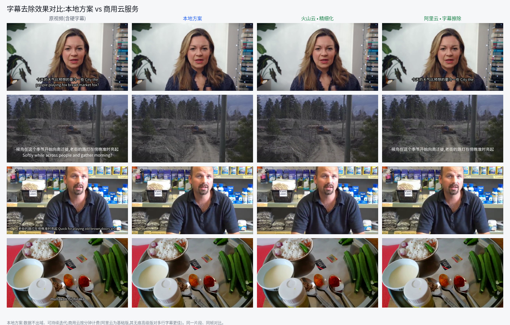

# subtitle-eraser — 视频硬字幕去除模块

输入带**硬字幕**的视频,输出去除字幕后的视频 + 处理报告 JSON。
中 / 英文,全自动(无需人工圈选),离线批处理。设计:**固定处理骨架 + 可插拔擦除后端**。

## 效果示例(处理前 → 处理后)


> 以上为**交付代码在真实素材上的实际端到端输出**(检测用 PP-OCRv5:`--detector paddle`)。
> 复现方式有二:效果图所用测试用例以压缩包**另行分发**,收到后放入 **[testcases/](testcases/)** 按说明运行,即可得到上图各行结果;
> 仓库也随附一段可一键运行的合成样例(含量化验证),见 **[samples/](samples/)**。

## 本地方案 vs 商用云服务



同一片段、同帧对比:本地方案(数据不出域、可持续迭代)与火山云、阿里云的字幕擦除服务。

## 处理流程


软字幕检查 → 字幕定位 → 事件聚合 → 掩码 + ROI → 擦除后端 → 羽化回贴 → 合流编码。

## 快速开始

```bash
pip install -r requirements.txt        # 骨架:numpy + opencv(另需系统 ffmpeg,见 tools/README.md)

# 用随附样例一键跑通并验证(默认检测器,无需额外依赖):
python -m subtitle_eraser --input samples/subbed.mp4 --output samples/erased.mp4
python samples/verify.py samples/erased.mp4        # 打印字幕带 PSNR:处理前≈15 → 处理后≈37 dB

# 处理真实复杂素材时,推荐 PP-OCRv5 精确检测(即上方效果图),需额外安装:
pip install paddlepaddle paddleocr
python -m subtitle_eraser --input in.mp4 --output out.mp4 --detector paddle
```

- `--detector paddle`:用 PP-OCRv5 精确定位字幕,效果如上方效果图(复杂素材推荐)。
- `--detector fixed`(默认):零额外依赖(仅 numpy + opencv),把画面底部固定条带当字幕区,对固定底部字幕即可(随附样例即用此模式)。

复现与验证的完整说明:合成样例见 **[samples/](samples/)**;另行分发的真实素材用例见 **[testcases/](testcases/)**。

## 文档

完整步骤、参数、处理报告格式与后端说明见 **[技术手册.md](技术手册.md)**。
