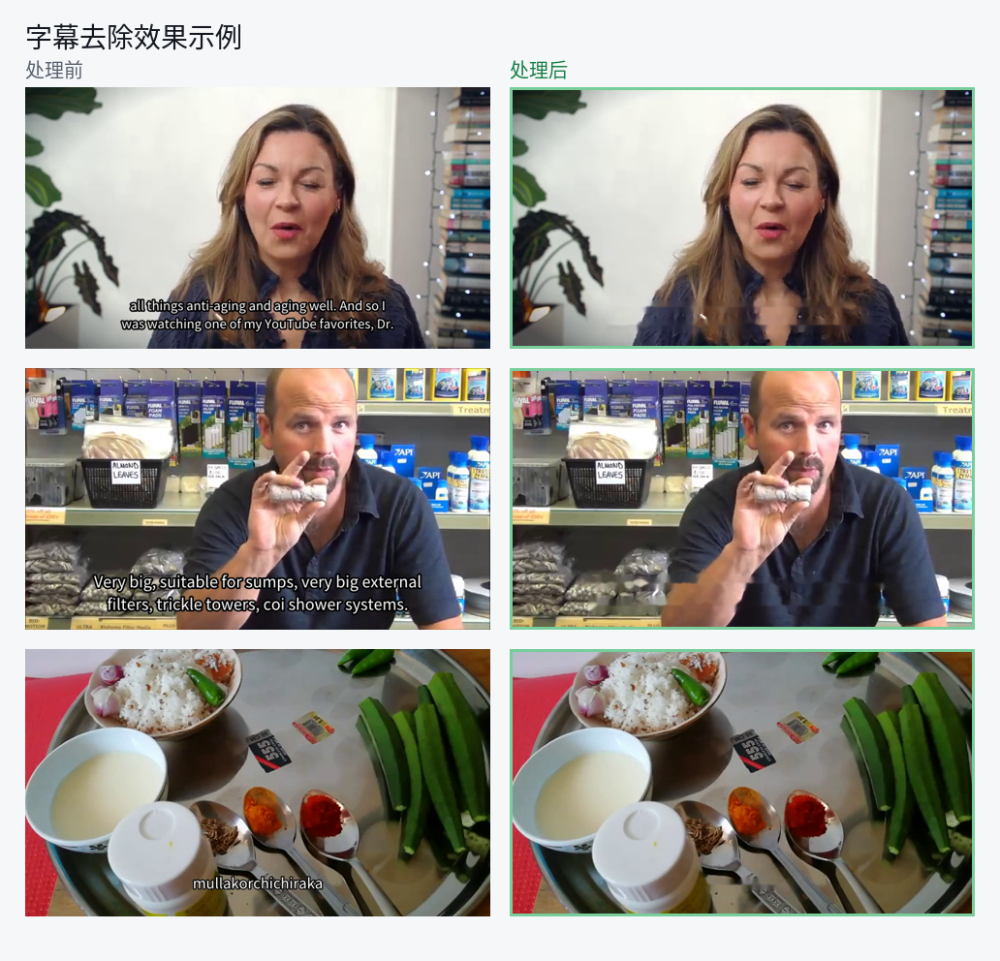
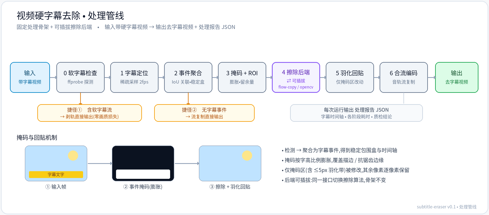

# 视频硬字幕去除模块 — 技术手册(v0.1)

## 1. 模块简介

输入一段带**烧录(硬)字幕**的视频,自动输出**去除字幕后的视频**,并附一份处理报告 JSON。

- **范围:** 中 / 英文硬字幕;全自动,无需人工圈选掩码;离线批处理。
- **设计:** 固定处理骨架 + 可插拔擦除后端——预处理、字幕定位、掩码、回贴、报告等骨架只实现一份;擦除算法以统一接口接入,可随场景替换。
- **输入输出:** 常见容器(mp4 / mkv 等);音轨原样保留;每次运行附处理报告 JSON。

**效果示例(处理前 → 处理后):**



## 2. 快速开始

```bash
pip install -r requirements.txt              # 骨架:numpy + opencv(另需系统 ffmpeg,见 tools/README.md)

# ① 用随附样例一键跑通并量化验证(默认检测器,无需额外依赖)
python -m subtitle_eraser --input samples/subbed.mp4 --output samples/erased.mp4
python samples/verify.py samples/erased.mp4  # 字幕带 PSNR:处理前≈15 → 处理后≈37 dB

# ② 处理真实复杂素材,推荐 PP-OCRv5 精确检测(即上方效果图)
pip install paddlepaddle paddleocr
python -m subtitle_eraser --input in.mp4 --output out.mp4 --detector paddle
```

运行结束会打印处理模式与字幕事件数,并在输出旁生成 `.report.json`。随附样例与验证说明见 [samples/](samples/)。

- **`--detector paddle`(复杂素材推荐)**:PP-OCRv5 精确定位字幕 → 只擦字幕笔画,效果如上方效果图。
- **`--detector fixed`(默认,零额外依赖)**:仅 numpy+opencv,把画面底部固定条带当字幕区;对固定底部字幕即可(随附样例即用此模式)。

> **效果图为交付代码在真实素材上的实际端到端输出**(检测用 `--detector paddle`),非人工掩码;本机复现与数值核对见随附样例 [samples/](samples/)。

## 3. 处理管线(七个步骤)



管线把"输入视频 → 去字幕视频"分为 7 个步骤,另有两条零成本捷径:

| 步骤 | 名称 | 做什么 |
|---|---|---|
| 0 | 软字幕检查 | `ffprobe` 探测容器内是否已有独立字幕流;若是(软字幕),直接剥轨返回,不进视觉管线(**捷径①**,零画质损失) |
| 1 | 字幕定位 | 以稀疏采样(默认 2fps)定位字幕文本区域。两种检测器:`fixed`(固定区域,如底部 35%)/ `paddle`(PP-OCRv5 文本检测,可选) |
| 2 | 事件聚合 | 把逐帧检测框按 IoU 关联 + 间隙容忍,聚合为**字幕事件**(同一条字幕从出现到消失的时间区间),得到稳定包围盒与时间轴;孤立误检被丢弃。**无任何事件 → 流复制直接输出(捷径②)** |
| 3 | 掩码 + ROI | 在检测框内**提取字幕笔画掩码**(而非整框:框内亮文字阈值 + 闭运算 + 膨胀覆盖描边),擦除只填笔画邻域、避免糊整块;裁出带上下文余量的 ROI 送修复,算力只花在字幕区 |
| 4 | 擦除后端 | 在 ROI 上擦除字幕。**可插拔**:当前提供 `flow-copy` 与 `opencv-debug` 两个后端(见 §6) |
| 5 | 羽化回贴 | 擦除结果以 ≤5px 羽化边缘贴回整帧;**掩码外像素逐像素保持原样** |
| 6 | 合流编码 | 视频重编码 + 音轨流复制回封装,输出成片 |

**内存策略:** 两遍读取——第一遍稀疏采样做检测,第二遍流式处理,帧仅在被字幕事件覆盖时进入缓冲并按 chunk 送后端;内存占用与 chunk 同阶,可处理长视频。

## 4. 命令行参数

| 参数 | 默认 | 说明 |
|---|---|---|
| `--input` / `--output` | (必填) | 输入 / 输出视频路径 |
| `--backend` | `flow-copy` | 擦除后端:`flow-copy` / `opencv-debug` |
| `--detector` | `fixed` | 字幕定位:`fixed`=固定区域;`paddle`=PP-OCRv5(需另装 paddleocr) |
| `--region` | `bottom:0.35` | `fixed` 检测器区域,格式 `bottom:<比例>` |
| `--sample-fps` | `2.0` | 检测采样帧率 |
| `--chunk` | `48` | 送后端的分块帧数 |
| `--assume-hard` | 关 | 即使检测到软字幕流也继续视觉管线 |
| `--report` | 同名 `.report.json` | 处理报告路径 |

## 5. 处理报告 JSON

每次运行输出报告,便于批处理核查与失败定位。主要字段:

- **`mode`**:`soft-strip`(软字幕剥轨)/ `no-events-copy`(无字幕,流复制)/ `erase`(执行擦除);
- **`streams` / `video_meta`**:输入音视频/字幕流信息、分辨率、帧率、帧数、检测步长;
- **`events[]`**:每条字幕事件的 `frame0`/`frame1`(起止帧)、`bbox`(包围盒)、`n_hits`(命中采样帧数)——即字幕时间轴;
- **`detect_seconds` / `erase_seconds`**:各阶段耗时;
- **`qc`**:质检结论(例如确认仅字幕区域被修改、其余画面保持原样)。

## 6. 擦除后端

统一接口 `erase_segment(frames, masks) -> frames`,可按场景替换,不改骨架。

- **`flow-copy`(默认)**:经典时序传播,无需 GPU。字幕遮住的背景常在邻帧露出——用 Farneback 光流把邻帧真实像素 warp 回当前帧;整段未露出的残余用单帧 Telea 兜底;掩码区做时域平滑抑制闪烁。适合静态 / 缓变背景,尤其固定字幕条带。
- **`opencv-debug`**:单帧 Telea 修复,最快,作快速基线与兜底;逐帧独立处理,运动场景会有帧间闪烁。

> 后端为**可插拔**设计:可在同一接口下接入更高质量的擦除算法,无需改动其余处理流程。

## 7. 目录结构

```
subtitle_eraser/          处理骨架 + 后端
  pipeline.py             七步编排
  probe.py                软字幕检查 / 剥轨
  detect.py               字幕定位(fixed / PP-OCRv5)
  events.py               事件聚合 + 掩码 + 羽化回贴
  mux.py  ffmpeg_tools.py  编解码 / 合流
  report.py               处理报告
  backends/               可插拔后端(base / flow_copy / opencv_debug)
docs/pipeline.svg         本手册管线插图
samples/                  随附样例(输入 + 干净参考 + 验证脚本,可一键复现)
tests/                    自测
```

## 8. 范围与限制(v0.1)

- 支持中 / 英文硬字幕;多语言、竖排、卡拉 OK 逐字特效不在本版范围。
- 对强半透明 / 花体字幕的处理效果有限;相关片段会在处理报告中标注,便于人工复核。
- 分辨率高于 1080p 时,建议先降采样,或仅对字幕区域保持原分辨率。
- 面向离线批处理,不支持实时处理。

## 9. 依赖

最小依赖 `numpy` + `opencv-python-headless`(见 `requirements.txt`)。PP-OCRv5 检测为可选项,需自行安装 `paddlepaddle` + `paddleocr`。
